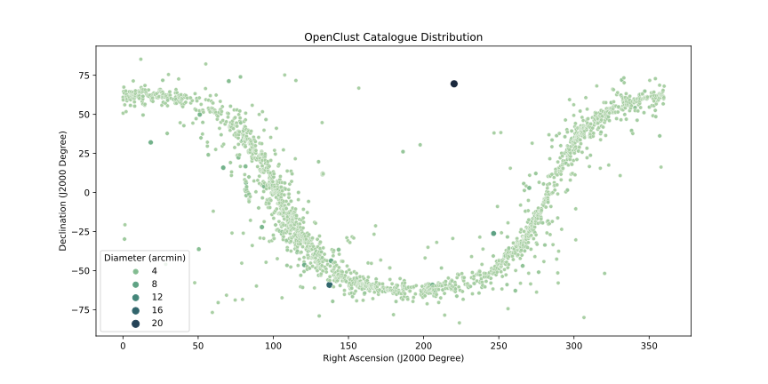

[![gaia-downloader image][gaia_downloader_badge]][gaia_downlaoder_image]

# Open Clusters Detection in Gaia DR2 Using ML Algorithms

<div align=center>
  <a href="https://www.unir.net"></a>
  <a href="https://sci.esa.int/gaia"></a>
</div>

Author: [_Álvaro Yunta, Carlos D._][author_profile]

Supervisor: [_Guzmán Álvarez, César A._][supervisor_profile]

## Table of Contents

- [Abstract](#abstract)
- [Data](#data)
- [Code](#code)
  - [Downloader](#downloader)
- [References](#references)

## Abstract

🚧 This is a work in progress project ...

## Data

The data used in this project has been recovered from the [Gaia Mission][gaia_mission] <span id="a1">[[1]](#f1)</span> archive.
Exactly, from the [Data Release 2][gaia_dr2] dataset.

It is a catalogue that contains over 1.692 million registries of stars data.

In order to reduce the amount of data to be downloaded,
the [OPENCLUST][openclust] <span id="a2">[[2]](#f2)</span> catalogue has been used to restrict
the sky regions to those areas corresponding to the clusters inside the catalogue
giving an extra marging to take into account stars outside clusters.



## Code

All code used in this project is available inside [`code/`](code) directory.
It is written in Python and contains downloaders, data managers, and the ML algorithms described in the thesis.

### Downloader

Data download can be started by running the following command:

([Docker][docker] is required for this purpose)

```sh
cd code
docker-compose start --detach
```

A [PostgreSQL][postgresql] will be initiated and a container will start to download Gaia data.

```
gaia_downloader | 2020-09-12 18:44:28 INFO: Loading OpenClust catalogue ...
gaia_downloader | 2020-09-12 18:44:31 INFO: OpenClust catalogue loaded!
gaia_downloader | 2020-09-12 18:44:31 INFO: ⏱ Downloading Melotte 25 stars from Gaia DR2 ...
gaia_downloader | INFO: Query finished. [astroquery.utils.tap.core]
gaia_downloader | 2020-09-12 18:53:09 INFO: Downloaded 433996 stars for Melotte 25
```

## References

1. <span id="f1"></span> This work has made use of data from the European Space Agency (ESA) mission Gaia (https://www.cosmos.esa.int/gaia), processed by the Gaia Data Processing and Analysis Consortium (DPAC, https://www.cosmos.esa.int/web/gaia/dpac/consortium). Funding for the DPAC has been provided by national institutions, in particular the institutions participating in the Gaia Multilateral Agreement. [↩️](#a1)

2. <span id="f2"></span> OPENCLUST - New Optically Visible Open Clusters and Candidates Catalog (https://heasarc.gsfc.nasa.gov/W3Browse/all/openclust.html) [↩️](#a2)

[openclust]: https://heasarc.gsfc.nasa.gov/W3Browse/star-catalog/openclust.html
[author_profile]: https://cdalvaro.io
[supervisor_profile]: https://www.unir.net/profesores/cesar-augusto-guzman-alvarez/
[gaia_mission]: https://www.cosmos.esa.int/web/gaia/the-mission
[gaia_dr2]: https://www.cosmos.esa.int/web/gaia/data-release-2
[docker]: https://www.docker.com
[postgresql]: https://www.postgresql.org

[gaia_downloader_badge]: https://github.com/cdalvaro/machine-learning-master-thesis/workflows/gaia-downloader%20image/badge.svg
[gaia_downlaoder_image]: https://github.com/users/cdalvaro/packages/container/package/gaia-downloader
